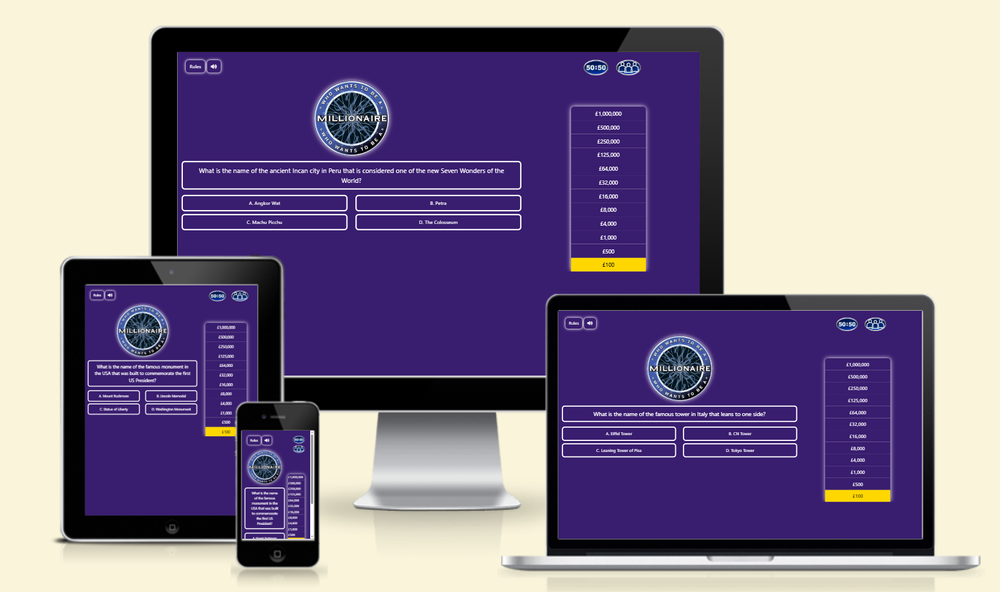
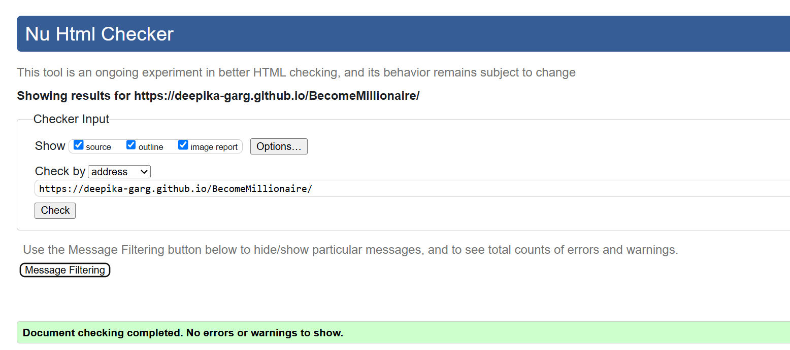
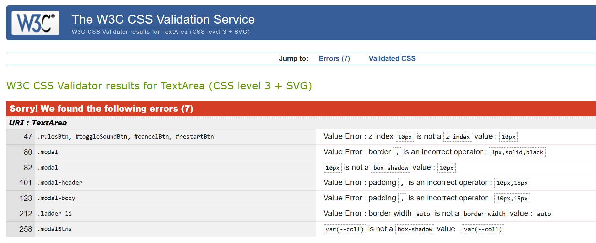
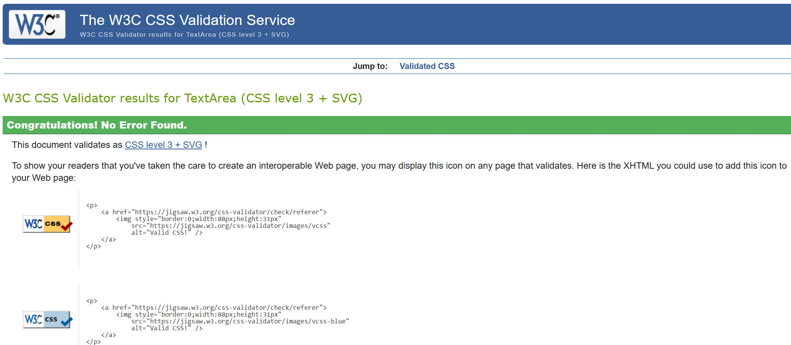

# Who wants to be a Millionaire Quiz

[Live site](https://deepika-garg.github.io/BecomeMillionaire/index.html)

 

## User Experience (UX)

### **User Stories:**

### User
  > - As a user I want to be able to play a fun and engaging game.
  > - As a user I want to test my general Knowledge about the world.
  > - As a user I want to intuitively navigate the site without confusion.
  > - As a user I want to be able to see a running score as the game progresses.
  > - As a user I want to see my final score when I have completed the quiz.
  > - As a user I want to see if any help/hint available for me to complete the quiz and win as much as possible.

### Quiz site Owner
  > - As the site owner I want to provide a fun and engaging quiz for the user.
  > - As the site owner I want the user to be able to replay the game multiple times.
  > - As the site owner I want to questions to appear randomly and different for the same level to make it more engaging.

### Scope Plane
  > - The website should have a link to the home page visible at all times so the user can reset the quiz without using browser navigation buttons. 
  > - The website should have a welcome message for the user that concisely describes the purpose of the site.
  > - The website should be visually appealing to the user and be styled in a way that is relevant to the Who wants to be millionaire theme.
  > - The website should keep a running total of the user's winning amount and display this to them in the progress ladder on the right.
  > - The website should let the user know whether they have selected the correct answer or not.
  > - Game should finish once user give the wrong answer. 
  > - Every time the user give wrong answer and game finishes, they must have choice to start the game again.

## Structure Plane 
### (This is a single page game. Messages are shown on click of buttons in form of Modal and are hidden or displayed via display: block/hidden css)

> - Site logo/title 

Home page
> - On click of Rules button on the page a modal appears and briefly describes quiz.
> - Different sounds has been added for the right and wrong answer and sound button can be used to toggle on/off the sound.
> - Who wants to be a millionaire logo/image for asthetic.
> - Randomly generated question with four answer buttons(with hover effect) to select from.
> - Progress ladder/bar on the right to show the winning amount.
> - Lifeline 50-50 to help the user for answer the questions. it will remove 2 wrong answers.
> - Lifeline Audiance Poll will highlight the right answer in green color. 

End game Modal/PopUp
> - PopUp will appear if the wrong answer selected to 'Start again' button to encourage user to restart the game.
> - Modal will show your winning amount with a congratulations message.

404 Page
> - 404 Page with the logo.
> - Error Message.
> - Return to home button to go back to the quiz 

### Wireframes:

Homepage:

 

### Surface plane

**Color**
Very less colors are used so that quiz looks neat and tidy. Color Adobe is used to create the color pallete. contrast of color is good. Only first two colors purple and white is used as site colors. Red and Green color is used to highlight the wrong and right answers respectively and Golden color is used to show the progress. 

html error

html fixes

css test images Error

corrected css

