# Who wants to be a Millionaire Quiz

[Live site](https://deepika-garg.github.io/BecomeMillionaire/index.html)

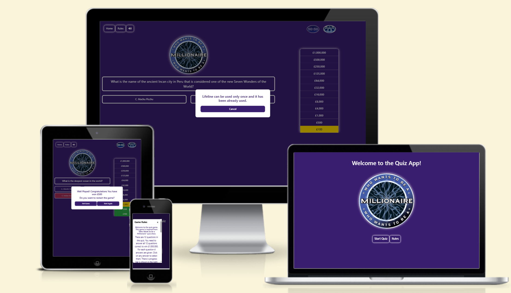

## Table of content

 1. [Planning](#Planning)
    * [Target Audiences](#Target-Audiences)
    * [User Stories](#User-Stories)   
    * [Structure Plane](#structure-plane)
 2. [Design](#Design)
      * [Wireframes](#Wireframes)
      * [ColourScheme](#Colour-scheme)
      * [Typography](#Typography)
      * [Imagery](#imagery)   
 3. [Existing Features](#Existing-Features)
    * [Favicon](#Favicon)
    * [Home Page](#Home-Page-feature)
    * [Quiz Page](#Quiz-Page-feature)
      * [Home Button](#home-button)
      * [Quiz](#quiz)
      * [Progres Bar](#progress-bar)
      *[Lifelines](#lifelines)
    * [404 Page](#404-page-feature)
 4. [Future Features](#Future-Features)
 5. [Technologies Used](#Technologies-Used)
    * [Languages](#Languages)
    * [Technology](#Technology)
 6. [Final Design](#Final-Design)
 7. [Deployment](#Deployment)
 8. [Testing](#Testing)
 9. [Credit](#Credit)
      * [Image Source](#images-sources)
      * [Tutorials](#tutorials)
      * [Content and Resources](#content-and-resources)
      * [Acknowledgments / Thank You's](#Acknowledgments/thanksyou's)
 
## Planning

Become Millionaire game app is design is influenced by actual famous game "Who wants to be a Millionaire". Same concept and theme is being try to recreate but with some convenient steps. Game has questions and four answer options, two lifelines and a progress ladder to highlight the winning score. Rules button and some message will be shown on screen when require. Some visual hover effects and sounds have been added to make the game more engaging and interesting. Questions are based on general knowledge so any one can play it and enjoy it.

[Back to top](#Table-of-content)

## Target Audiences
Actual plan was created a JavaScript question game but later on it was changed to general questions so that anyone can play and enjoy the game. Winning money factor has been added to motivate the user to play and win more money. 

[Back to top](#Table-of-content)

## User Experience (UX)

### **User Stories:**

### User
  > - As a user I want to be able to play a fun and engaging game.
  > - As a user I want to test my general Knowledge about the world.
  > - As a user I want to intuitively navigate the site without confusion.
  > - As a user I want to be able to see a running score/prize money as the game progresses.
  > - As a user I want to see my final winning amount when I have completed the quiz.
  > - As a user I want to see if any help/hint available for me to complete the quiz and win as much as possible.

### Quiz site Owner
  > - As the site owner I want to offer a Welcome Page.
  > - As the site owner I want to provide a fun and engaging quiz for the user.
  > - As the site owner I want the user to be able to replay the game multiple times.
  > - As the site owner I want to questions to appear randomly and different for the same level to make it more engaging.

### Scope Plane
  > - The website should have a link to the home page visible at all times so the user can reset the quiz without using browser navigation buttons. 
  > - The website should have a welcome message for the user that concisely describes the purpose of the site.
  > - The website should be visually appealing to the user and be styled in a way that is relevant to the Who wants to be millionaire theme.
  > - The website should keep a running total of the user's winning amount and display this to them in the progress ladder on the right.
  > - The website should let the user know whether they have selected the correct answer or not.
  > - Game should finish once user give the wrong answer. 
  > - Every time the user gives wrong answer and game finishes, they must have choice to start the game again.

  [Back to top](#Table-of-content)

## Structure Plane 
### (This is a single page game, with a welcome Page and 404 page. Messages are shown on click of buttons in form of Modal and are hidden or displayed via display: flex/none css)

> - Site logo/title 

Home Page
> - Welcome message to the user.
> - Site Logo
> - Start Quiz button to start the game
> - Rules button to explain the games rules to user/player

Quiz page
> - Home button will take user to Welcome page.
> - On click of Rules button on the page a modal appears and briefly describes quiz.
> - Different sounds has been added for the right and wrong answer and sound button can be used to toggle on/off the sound.
> - Who wants to be a millionaire logo/image for aesthetic.
> - Randomly generated question with four answer buttons(with hover effect) to select from.
> - Progress ladder/bar on the right to show the winning amount.
> - Lifeline 50-50 to help the user for answer the questions. it will remove 2 wrong answers.
> - Lifeline Audience Poll will highlight the right answer in green colour. 

End game Modal/Pop-up
> - popups will appear if the wrong answer selected to 'Start again' button to encourage user to restart the game. Exit Game button will redirect the user to Welcome Page. 
> - Modal will show your winning amount with a congratulations message.

Lifeline used Modal
> - It shows the message lifeline has already been used, if user try to take it's help more than once.

404 Page
> - 404 Page with the logo.
> - Error Message.
> - Return to home button to go back to the Welcome Page/Home Page 

[Back to top](#Table-of-content)

### Wireframes:

HomePage:
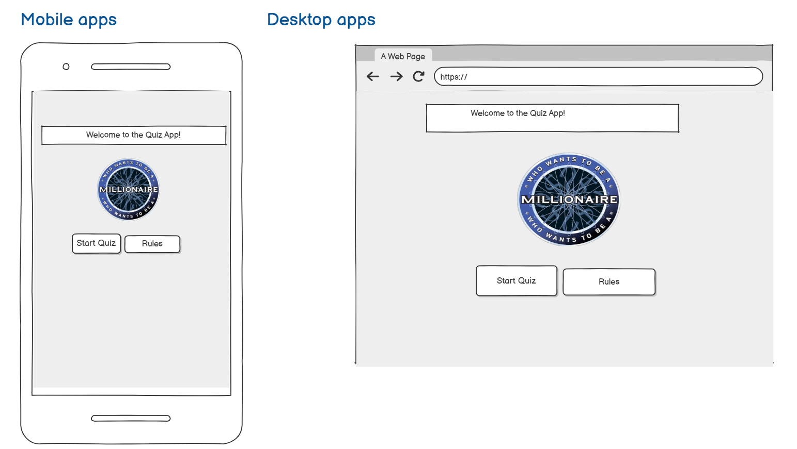

QuizPage:

404ErrorPage:
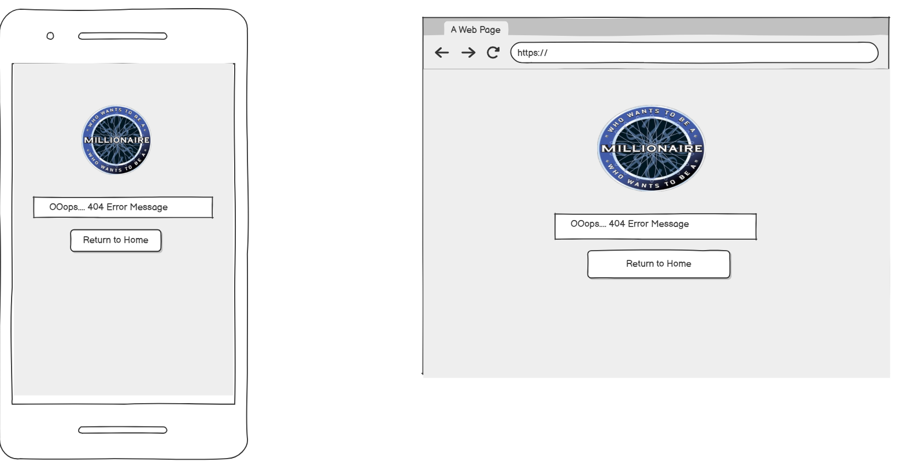

[Back to top](#Table-of-content)
 

### Surface plane

### Colour Scheme
Very less colours are used so that quiz looks neat and tidy. [Color Adobe](https://color.adobe.com/) is used to create the color pallete. contrast of color is good. Only first two colors purple and white is used as site colors. Red and Green color is used to highlight the wrong and right answers respectively and Golden color is used to show the progress. 

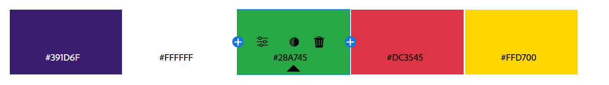

[Back to top](#Table-of-content)

### Typography
Font for the quiz is used 'Segoe UI'. Different font size is being used between question and answers to differentiate but same font.

[Back to top](#Table-of-content)

### Imagery
In total only three images are used in the quiz. One for logo and favicon and two images of phone and audience for two life lines respectively. 

Image Sources  
[WhoWantsToBeMillionaireLogo](https://img.playstationtrophies.org/images/trophies/1297/ico.png)

[AudiancePoll](https://millionaire.fandom.com/wiki/Ask_the_Audience?file=ATA_2018.gif)

[Fifty-Fifty](https://millionaire.fandom.com/wiki/50:50?file=50-50_2018.gif)

[Back to top](#Table-of-content)

## Existing Features

### Favicon
> - Title/logo

### Home Page Feature

> - Start Quiz button
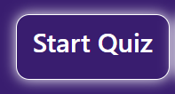

> - Rules Explained
Modal is used to describe the rules of the game on the click of rules button on the top of page.

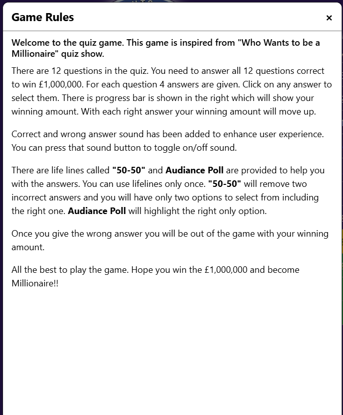

### Quiz Page Feature

#### Home Button
> - Home Button
Home button will take you to the welcome screen page, in case anybody wants to go.
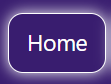

> - Rules Button 
Same rule button is given on quiz page as well for convenience.

#### Sound/Audio
> - Sound On/Off Button

Correct answer and wrong answer sound has been added, which can be which can be toggle on and off by the user for their preference.

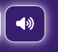

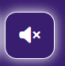

#### Quiz
> - Quiz questions and answers

Questions are pulled from the defined list of 12 sets with 3 questions in each set.

Answer buttons highlight when hovered over (large devices) to create positive UX.

[Back to top](#Table-of-content)

#### Progress Bar
Score/Prize Money increments with every correct answer.

After user has selected an answer, if the answer is correct then new question appear and progress bar get updated as in previous image. If the answer is wrong then selected answer get highlighted with red color and right answer with green color. screen freeze and this is end of game.

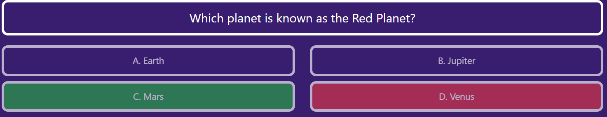

Just after 1 second a modal appears and indicate Game End. It shows the prize money, congratulate the player and give option to play again.

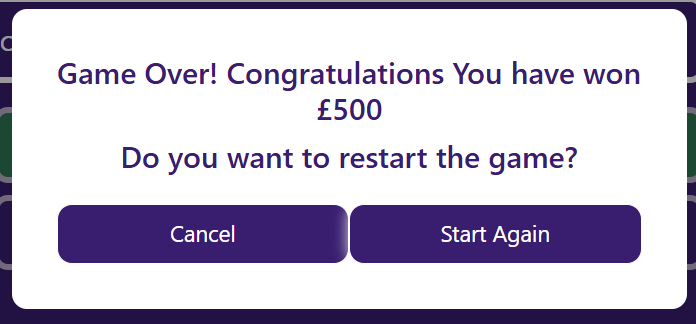

[Back to top](#Table-of-content)

#### Lifelines

There are 2 lifelines are provided to help player, called '50:50' and 'Audience'. These will help user to figure out the right answer and win maximum money they can. 

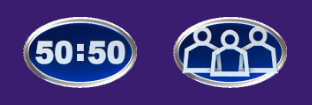

**Lifeline Fifty-Fifty**
 On click of '50:50' two actions occur.
 1. Two random wrong answers get deleted and player is left with only 2 choices to select from including the right one. It makes game easy for player.

 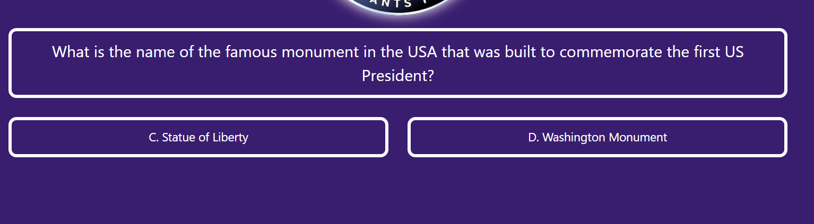

2. Button itself get faded to indicate that it is used.

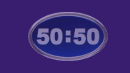

**Lifeline AudiencePoll**
 On click of 'AudiencePoll' lifeline two actions occur.
 1. Right answer will get highlight with 'Green' color.

 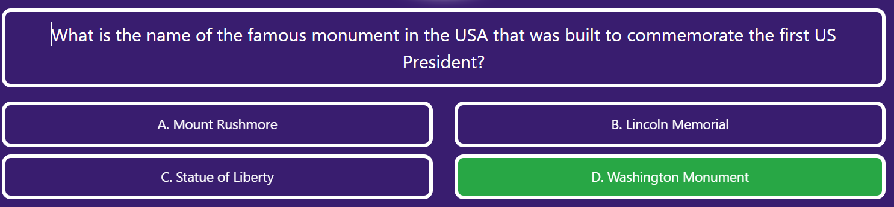

2. Button itself get faded to indicate that it is used.

3. If you try to use any of the lifeline again during the same game. It shows a message "Lifelines can be used only once".

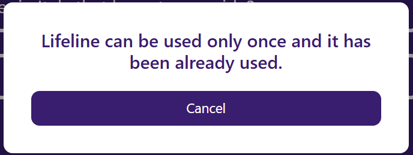

## 404 Page features
> - Logo
> - OOps... Message
> - Return to home button

[Back to top](#Table-of-content)

## Future Features

Quiz Page

> - I would like to include some sort of animation when user win £1,000,000.
> - I want to add the third lifeline Phone a Friend like actual original game.  
> - I would learn and add keyboard Navigation for my quiz.

## Languages used

> - HTML5
> - CSS3
> - JavaScript

###  Technology 

[Balsamiq](https://balsamiq.com/) - Used to create wireframes.

[Github](https://github.com/) - To save and store the files for the website.

[Google Fonts](https://fonts.google.com/) - To import the fonts used on the website.

[Font Awesome](https://fontawesome.com/) - For the iconography on the website.

[Bootstrap Version 5](https://getbootstrap.com/) - The framework for the website. Code for the navigation bar, carousel, cards and form were used and modified. Additional CSS styling was also implemented in style.css.

[Favicon.io](https://favicon.io/) To create favicon.

[Color Adobe](https://color.adobe.com/)  To create the color pallete

[Convertio](https://convertio.co/) - To covert MP4 sound to MP3 sound. 

[Am I Responsive?](https://ui.dev/amiresponsive) To show the website image on a range of devices.

[Webaim](https://wave.webaim.org/) To test accesibility of the deployed website.

Google Dev Tools - To troubleshoot and test features, solve issues with responsiveness and styling.
Visual Studio Code is used as an editor to write code.

[Back to top](#Table-of-content)

## Final Design

## Home Page
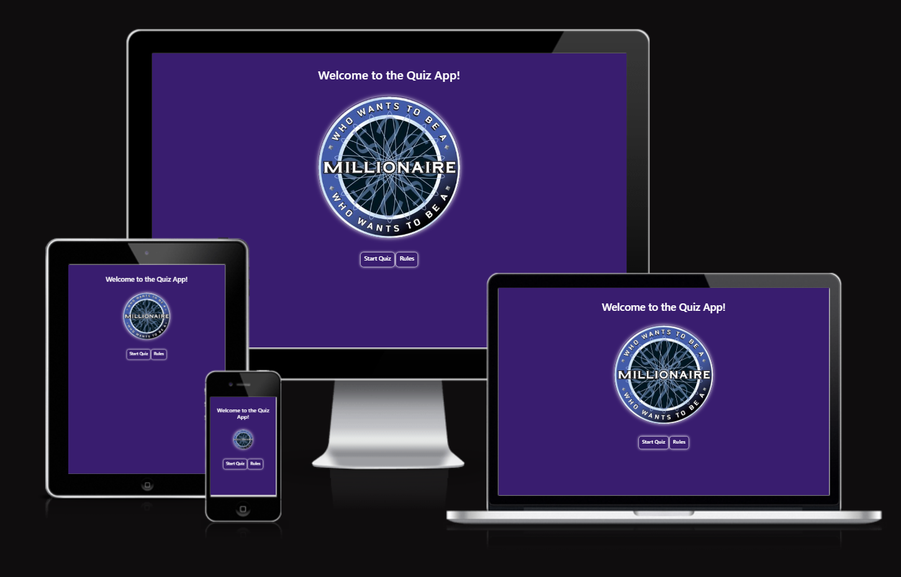

## Quiz Page
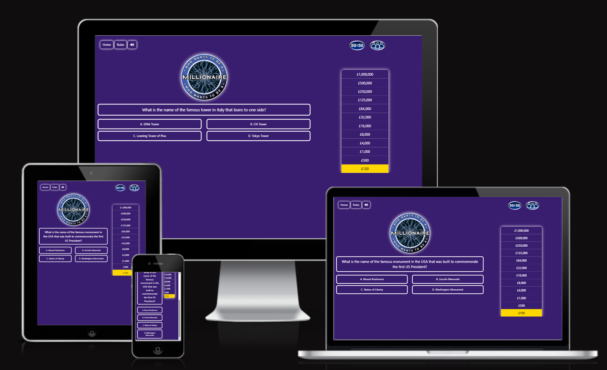

## 404 Page

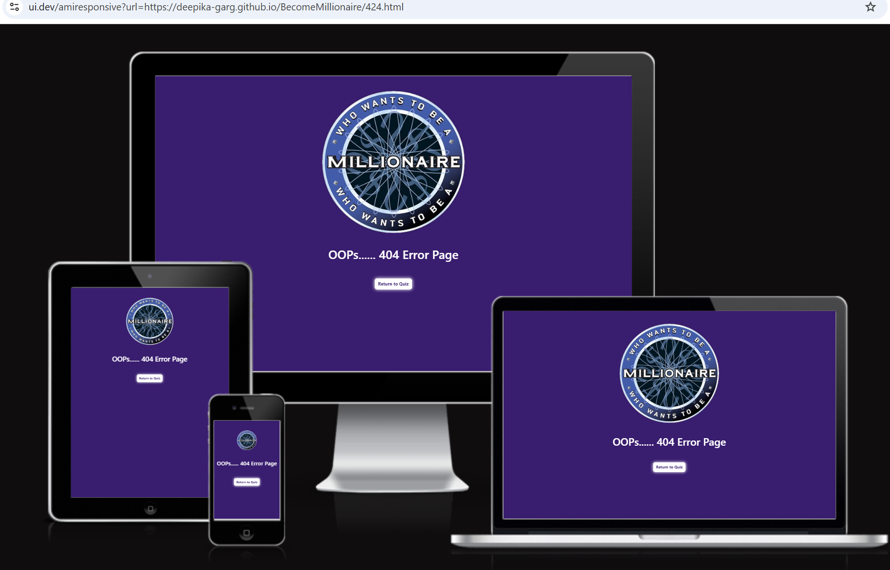

[Back to top](#Table-of-content)

## Deployment

The steps to deploy the project are as follows:

1. Click on Settings on the navigation menu in the repository
2. Selected the Pages menu on the left side bar.
3. In the first dropdown menu labelled Source select the branch of the name 'main' from the dropdown.
4. In the next dropdown menu select '/root' as the default option.
5. Select Save
6. After couple of minutes project become live

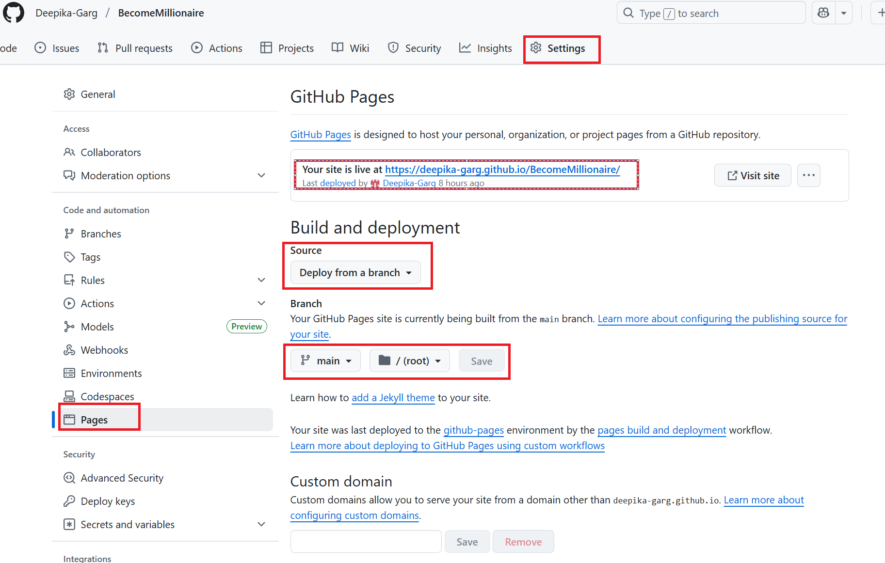

7. If you want your own custom domain name you would have to purchase one with an external provider and enter it in the box towards the bottom of the page above.

## How to Clone
To clone the repository:

1. Log in (or sign up) to GitHub.
2. Go to the repository for this project, Deepika-Garg/BecomeMillionaire
3. Click on the code button, select whether you would like to clone with HTTPS, SSH or GitHub CLI and copy the link shown.
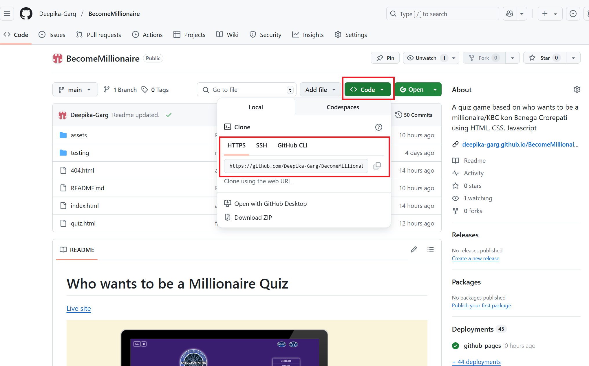

4. In your IDE of choice, open 'Git Bash'.
5. Change the current working directory to the location where you want the cloned directory to be made.
6. Type 'git clone' into the terminal and then paste the link you copied in step 3. Press enter.

[Back to top](#Table-of-content)

## Testing

I tested my site throughout the entire build. I have gone through each page using google chrome developer tools to ensure that each page is responsive on different screen sizes and devices and troubleshoot any issues mentioned in console as I went along. 

Please refer to [Test Document](TESTING.md) for all information to test BecomeMillionaire quiz app.

[Back to top](#Table-of-content)

## Credits
### Images sources:
> - [WhoWantsToBeMillionaireLogo](https://img.playstationtrophies.org/images/trophies/1297/ico.png)
> - [AudiencePoll](https://millionaire.fandom.com/wiki/Ask_the_Audience?file=ATA_2018.gif)
> - [Fifty-Fifty](https://millionaire.fandom.com/wiki/50:50?file=50-50_2018.gif)

[Back to top](#Table-of-content)

### Tutorials:
> - Quiz building tutorial (https://www.youtube.com/watch?v=PBcqGxrr9g8)
> - Quiz building tutorial (https://www.youtube.com/watch?v=TYCHpO4D50Y)
> - JavaScript tutorials w3 schools (https://www.w3schools.com/js/default.asp)
> - JavaScript basics from code Institute course/tutorials given.

[Back to top](#Table-of-content)

### Content and Resources:
> - Fonts sourced from Google Fonts: (https://fonts.google.com/selection/embed)
> - Am I responsive screenshots for Readme: (https://ui.dev/amiresponsive)
> - Markdown cheat sheet: (https://github.com/adam-p/markdown-here/wiki/Markdown-Cheatsheet)
> - Favicon: (https://favicon.io/emoji-favicons/)

[Back to top](#Table-of-content)

#### Acknowledgments: 
I would like to thank following people for the help and advice they have given me in this project.

* My mentor Precious Ijege for his guidance and feedback throughout this milestone project.
* Marco Tot our class cohort facilitator for his constant assistance and encouragement.
* Slack Community for their endless support.
* Code institute for the outstanding course documentation and for providing opportunity to learn and develop this project.

[Back to top](#Table-of-content)

