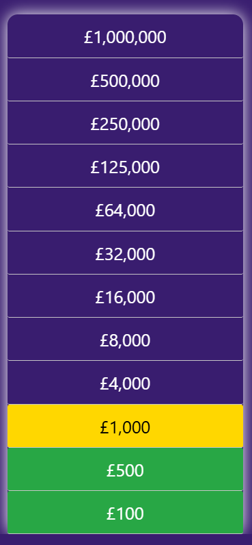
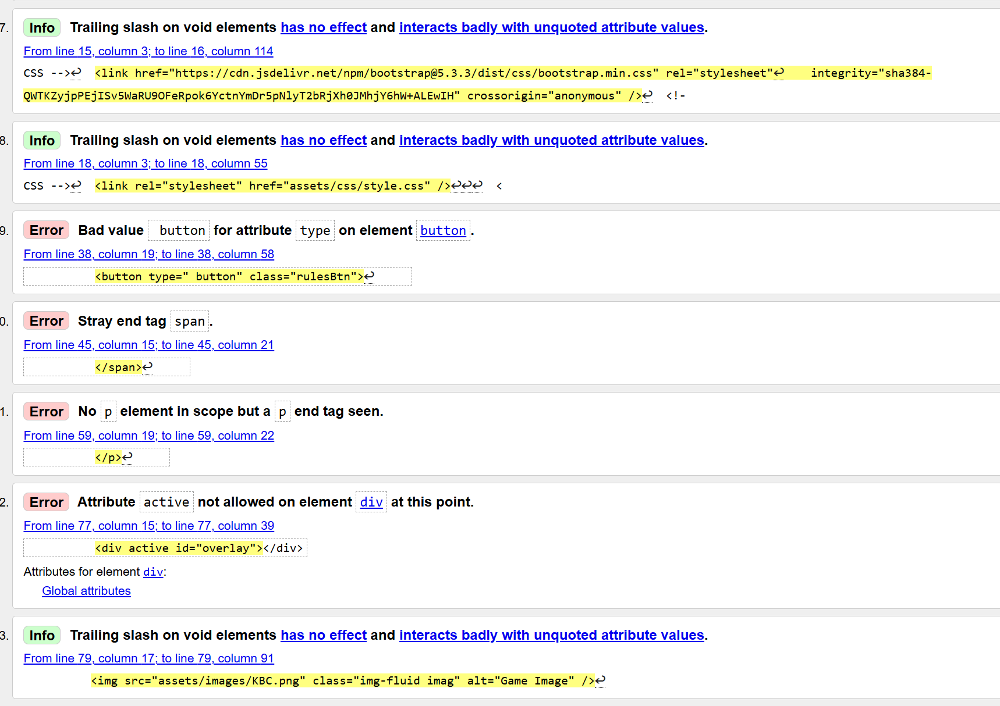
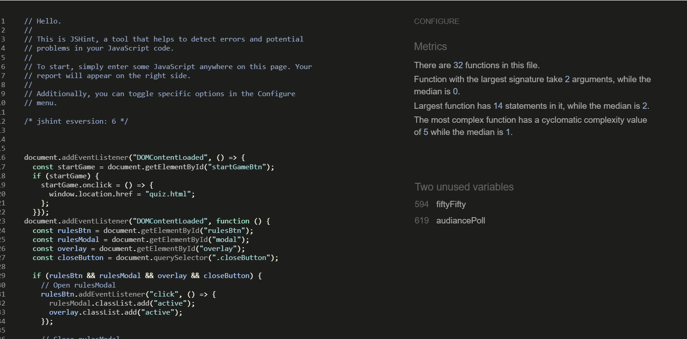
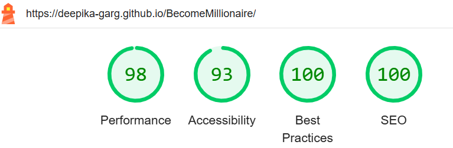

# Who wants to be a Millionaire Quiz

[Live site](https://deepika-garg.github.io/BecomeMillionaire/index.html)

 

## User Experience (UX)

### **User Stories:**

### User
  > - As a user I want to be able to play a fun and engaging game.
  > - As a user I want to test my general Knowledge about the world.
  > - As a user I want to intuitively navigate the site without confusion.
  > - As a user I want to be able to see a running score as the game progresses.
  > - As a user I want to see my final score when I have completed the quiz.
  > - As a user I want to see if any help/hint available for me to complete the quiz and win as much as possible.

### Quiz site Owner
  > - As the site owner I want to provide a fun and engaging quiz for the user.
  > - As the site owner I want the user to be able to replay the game multiple times.
  > - As the site owner I want to questions to appear randomly and different for the same level to make it more engaging.

### Scope Plane
  > - The website should have a link to the home page visible at all times so the user can reset the quiz without using browser navigation buttons. 
  > - The website should have a welcome message for the user that concisely describes the purpose of the site.
  > - The website should be visually appealing to the user and be styled in a way that is relevant to the Who wants to be millionaire theme.
  > - The website should keep a running total of the user's winning amount and display this to them in the progress ladder on the right.
  > - The website should let the user know whether they have selected the correct answer or not.
  > - Game should finish once user give the wrong answer. 
  > - Every time the user give wrong answer and game finishes, they must have choice to start the game again.

## Structure Plane 
### (This is a single page game. Messages are shown on click of buttons in form of Modal and are hidden or displayed via display: block/hidden css)

> - Site logo/title 

Home page
> - On click of Rules button on the page a modal appears and briefly describes quiz.
> - Different sounds has been added for the right and wrong answer and sound button can be used to toggle on/off the sound.
> - Who wants to be a millionaire logo/image for asthetic.
> - Randomly generated question with four answer buttons(with hover effect) to select from.
> - Progress ladder/bar on the right to show the winning amount.
> - Lifeline 50-50 to help the user for answer the questions. it will remove 2 wrong answers.
> - Lifeline Audiance Poll will highlight the right answer in green color. 

End game Modal/PopUp
> - PopUp will appear if the wrong answer selected to 'Start again' button to encourage user to restart the game.
> - Modal will show your winning amount with a congratulations message.

404 Page
> - 404 Page with the logo.
> - Error Message.
> - Return to home button to go back to the quiz 

### Wireframes:

Homepage:

 

### Surface plane

**Color**
Very less colors are used so that quiz looks neat and tidy. [Color Adobe](https://color.adobe.com/) is used to create the color pallete. contrast of color is good. Only first two colors purple and white is used as site colors. Red and Green color is used to highlight the wrong and right answers respectively and Golden color is used to show the progress. 

**Font:**
Font for the quiz is used 'Segoe UI'. Different font size is being used between question and answers to differentiate but same font.

**Images:**
In total only three images are used in the quiz. One for logo and favicon and two images of phone and audiance for two life lines respectively. 

Image Sources  
[WhoWantsToBeMillionaireLogo](https://img.playstationtrophies.org/images/trophies/1297/ico.png)

[AudiancePoll](https://millionaire.fandom.com/wiki/Ask_the_Audience?file=ATA_2018.gif)

[Fifty-Fifty](https://millionaire.fandom.com/wiki/50:50?file=50-50_2018.gif)

## Existing Features
> - Title/logo

> - Rules Explained
Modal is used to describe the rules of the game on the click of rules button on the top of page.

The background and logo change colour accordingly using JS.

> - Sound On/Off Button

Correct answer and wrong answer sound has been added, which can be which can be toggle on and off by the user for there preference.

> - Quiz questions and answers

Questions are pulled from the defined list of 12 sets with 3 questions in each set.

Answer buttons highlight when hovered over (large devices) to create positive UX.

Score/Prize Money increments with every correct answer.

After user has selected an answer, if the answer is correct then new question appear and progress bar get updated as in previous image. If the answer is wrong then selected answer get highlighted with red color and right answer with Green color. screen freeze and this is end of game.

Just after 1 second a modal appear and indicate Game End. It shows the prize money, congratulate the player and give option to play again.

## Future Features
### Home page
> - Ratherthan a single page application I will add a home page with welcome message and game rule and then convert this only page as a quiz page.
> - I would like to include some sort of animation when user win £1,000,000.
> - I want to add the third lifeline Phone a Friend like actual original game.  
> - I would learn and add keyboard Navigation for my quiz.

## Languages used

> - HTML5
> - CSS3
> - Javascript

## Technologies used
> - Bootstrap: I used [Bootstrap](https://getbootstrap.com/docs/5.3/getting-started/) to help build my site in a responsive layout. 
> - Google Fonts: The font 'Segoe UI' was used for the main body of the site. 
> - Font Awesome: was used to import sound on/off icons for the sound button. 
> - Git: I used VSCode as a code space to create the site from which I pushed my site to Github for deployment.
> - GitHub: I used GitHub as the respository for the projects code after being pushed from VSCode.
> - Balsamiq: I used Balsamiq to create wireframes to outline to design of the site.
> - Color Adobe: I used color Adobe to generate a colour palette.

## Testing

## HTML validator:

Errors thrown by HTML Validator during Testing. 

Errors has been corrected and following is the screenshot provided.

## CSS validator:

Errors thrown by CSS Validator during Testing.

Errors has been corrected and following is the screenshot provided.

## JavaScript validator:

Note: Functions shown unused in the Validator image are the function which are called in HTML file on onclick() event of corresponding buttons.

## Lighthouse Testing

**Testing for Desktop**

Some Meta tags and aria-labels has been added to improve the testing results.

**Testing for Mobile Device**

