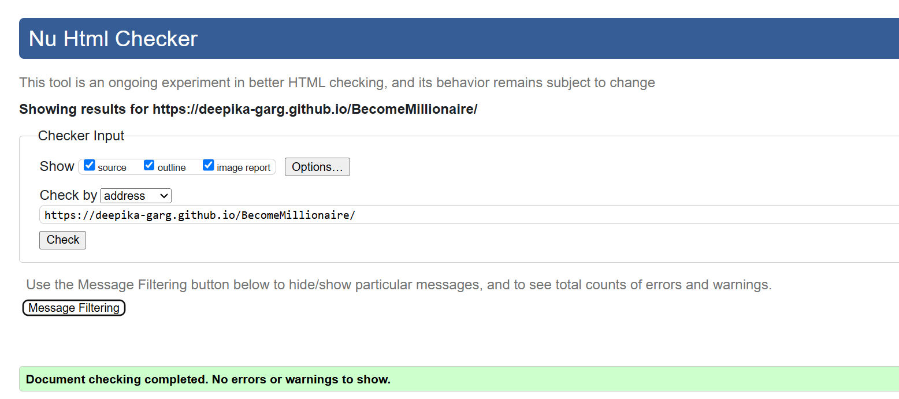
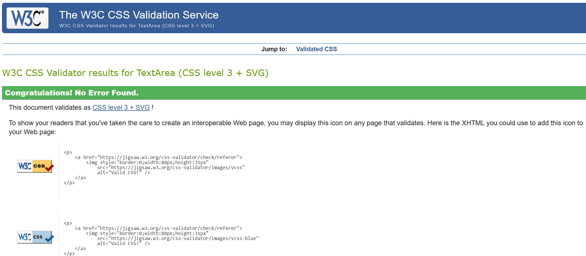
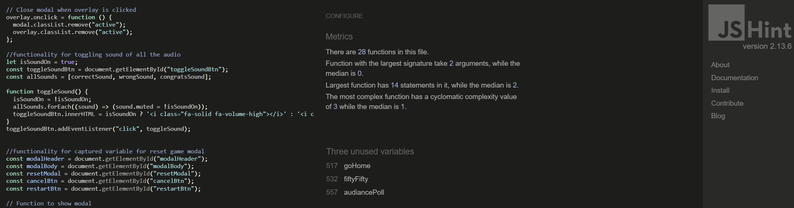
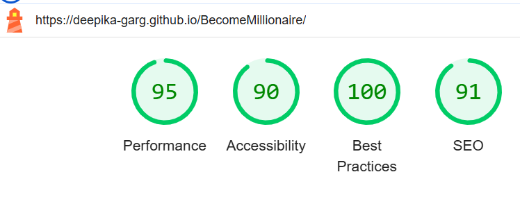
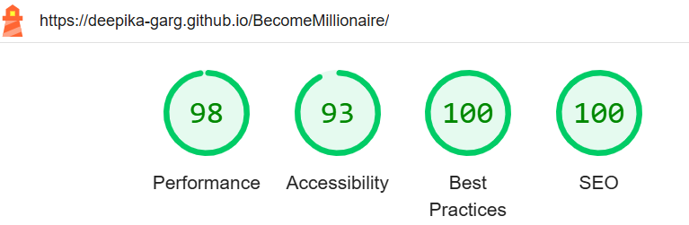
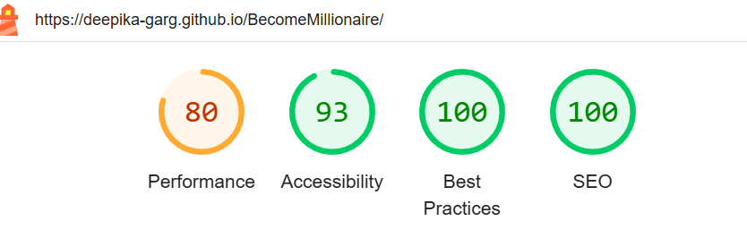
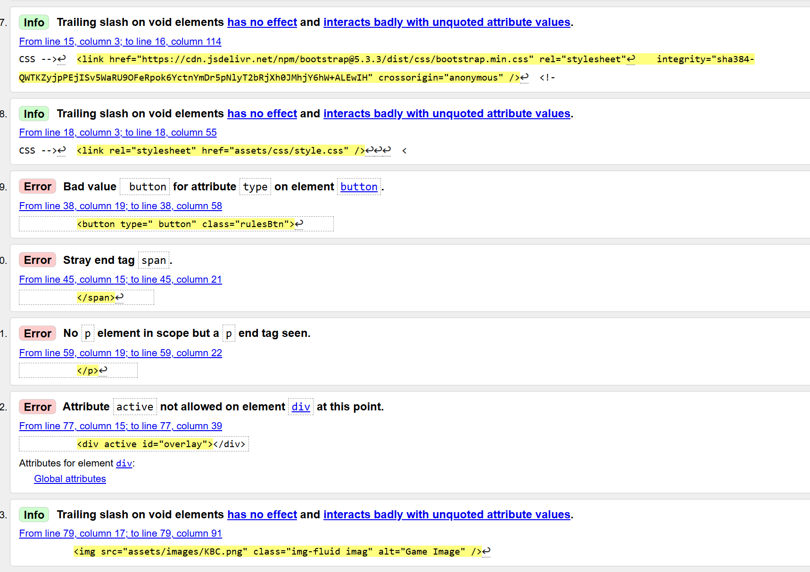
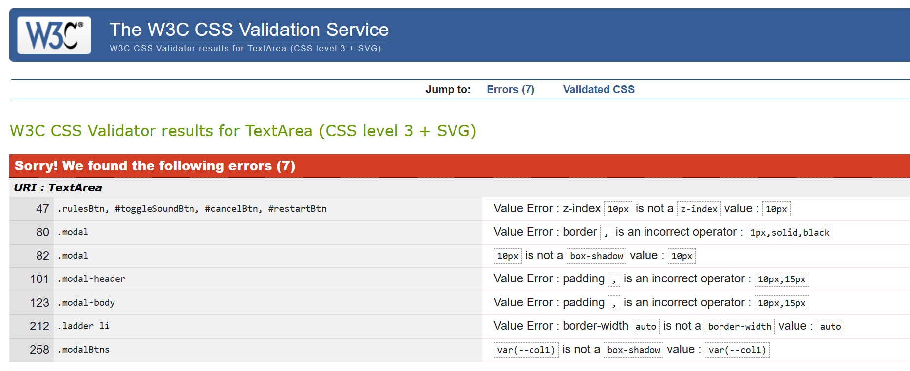

[Testing](#Testing)
    * [Code Validation](#Code-Validation)
      * [W3C Validator](#w3c-validator)
      * [JSHint Validator](#javaScript-validator)
      * [Lighthouse](#lighthouse-testing)
    * [Known Bugs](#Known-bugs)
    * [Manual Testing](#manual-testing)
    * [Testing User Stories](#user-stories-testing)
    * [Responsiveness Testing](#Responsiveness-testing)
    * [Browser Compatibility](#browser-compatibility)

## Code Validation

### W3C Validator

<a href="https://validator.w3.org/" target="_blank" rel="noopener" >W3C html Validator</a> was used to validate the HTML on all pages of the website. [W3C CSS Validator](https://jigsaw.w3.org/css-validator/) was also used to validate the CSS.
Minor errors were found which I have described in [Known Bugs](#known-bugs) section. After a fix and retest, no errors were returned.

    
## HTML validator:

Errors has been corrected and following is the screenshot provided.

## CSS validator:

Errors has been corrected and following is the screenshot provided.

## JavaScript validator:

Note: Functions shown unused in the Validator image are the function which are called in HTML file on onclick() event of corresponding buttons.

## Lighthouse Testing

**Testing for Desktop**

Some Meta tags and aria-labels has been added to improve the testing results.

**Testing for Mobile Device**

[Back to top](#Testing)

## Known Bugs

  ## Bugs section
1. Errors thrown by HTML Validator during Testing. All error were corrected.

2. Errors thrown by CSS Validator during Testing. All errors were corrected.

3. Quiz Page takes time to load which is visible sometimes to the user. I tried but could not fix it. Actions I took is 
> - preload sounds.
> - JavaScript is attached at the end of HTML code.

Alot of actions happening like questions and progress ladder are randomly generating,  and rendering at page load which might be the reason of delaying.

[Back to top](#Testing)

## Manual Testing
### User testing
| Feature being tested:| Steps                                | Expected outcome  | Pass/Fail |
|:---------------------|:-------------------------------------|:------------------|-----|
| Rules button - Logo | Click of Rules button. | A popup should appear with all the game rules.           | PASS |
| Rules Popup/Modal | click on X/close button or click on anywhere on the screen other than popup.                                 | Popup should disappear.  | PASS |
| Sound button | click the sound button | Sound of correct answer and wrong answer should be toggle on/off | PASS |
| Game Logo | Hover on the game logo | Logo should be bigger in size by 10% | PASS |
| Question's font size | Test on smaller screen size | It's font size should be smaller on small screen. | PASS |
| Questions | Play quiz multiple time. | Questions should be randomly generated out of set of 3 questions for same level/prize money. | PASS |
| Answer buttons | Hover mouse over buttons/Tap on mobile device. | Buttons should highlight when hovered and select the answer when clicked. | PASS |
| Answer buttons |Select the correct answer | 1. Button should highlight with 'Green' color. 2. In the progress bar on the right winning amount should be green and next question amount should be golden color. 3. Next question should appear randomly on the screen from set of 3 questions.  | PASS |
| Answer buttons | Select the wrong answer | Buttons should highlight with 'Red' color and correct answer should highlight with 'Green' color. pop-up should appear to warn that game is over and 'Start Again' button. | PASS |
| Quiz/Home page - UX | Read through every question. | Text should all be clear and easily readable and the questions make sense. | PASS|
|Progress Bar/Ladder - score/Prizemoney counter | Play quiz whole way through on each level. | Score should increment by 1 step up for every correct answer. Current Question should be highlighted with golden color and score for completed questions should be highlighted with green color. | PASS |
| Fifty-Fifty Lifeline | Click on it. | Two wrong answers should disappear randomly. Now you should be left with only two answer options including correct one. Lifeline's visibility should be degraded immediately to indicate that it has been used.| PASS |
| Fifty-Fifty Lifeline | Click on it again during the same game. | Alert message should appear to warn Lifelines can be used only once. No answer option is removed this time.| PASS |
| Audience Poll Lifeline | Click on it. | Right answer should be highlighted with Green Color. Lifeline's visibility should be degraded immediately to indicate that it has been used.| PASS |
| Audience Poll Lifeline | Click on it again during the same game. | Alert message should appear to warn Lifelines can be used only once. No answer option is highlighted green this time.| PASS |
| End game - finish message | Complete quiz or select wrong answer | End game message should alter based on winning amount. Text should be clear and legible. | PASS |
| End game  - Start again button | Click button | Quiz should reset back to the beginning | PASS| 
| Responsiveness - UX | Resize site for all device sizes. | Check that images/text/other elements resize as expected, text should be readable and elements should all be visible and not overlap randomly. | PASS|
| 404 Page - UX | Make a mistake in browser address | 404 Page should appear with the site logo and an Error message with a back to main quiz button | PASS|
| Back to Home Page Button | Click on it | It should redirect you to home/main/quiz page with a reset quiz. | PASS|

[Back to top](#Testing)

## User stories Testing

| Expected outcome:| Steps                                | Result |
|:---------------------|:-------------------------------------|-----|
| As a user I want to be able to play a fun and engaging game.:| Engaging UX Design using subtle and contrast color, easily navigating quiz game with helplines are designed.                                | User will definitely be curious to play quiz |
| As a user I want to test my general Knowledge about the world.:| All the questions added in the game are general knowledge questions about the world                                | User will test his knowledge in an engaging way. |
| As a user I want to intuitively navigate the site without confusion.:| Rules button is given to popup the clear instructions to avoid any confusion                                | user can easily navigate the site. |
| As a user I want to be able to see a running score/prize money as the game progresses.:|Clearly visible Progress bar is given on right side of screen to show the winning amt.                                | Updated score is always visible to the user |
| As a user I want to see my final winning amount when I have completed the quiz.:| A popup comes up at the end of game to let user know their final winning amount.                               |User will always know the final amount of winning at the end of the game. So, working as expected.  |
| As a user I want to see if any help/hint available for me to complete the quiz and win as much as possible.:| Two lifelines are provided to user to help during the play                                | Both the lifelines are working as expected |

 [Back to top](#Testing)

### Quiz site Owner
| Expected outcome:| Steps                                | Result |
|:---------------------|:-------------------------------------|-----|
|  As the site owner I want to offer a Welcome Page.| I have added a welcome page with start game button and rules button.                                | site is working as expected |
| As the site owner I want to provide a fun and engaging quiz for the user.| On the Start Game button click on welcome page actual quiz start. Each question with four answers.                              | As Expected |
| As the site owner I want the user to be able to replay the game multiple times.| At the end of game user is always asked to play the game again.                                | As Expected |
| As the site owner I want to questions to appear randomly and different for the same level to make it more engaging.|I have added 12 sets of questions, Each set with 3 questions. questions selecting is done randomly                                | Pass as Expected |
  
[Back to top](#Testing)

## Responsiveness Testing

* The responsive design tests were carried out manually with [Google Chrome DevTools](https://developer.chrome.com/docs/devtools/) and [Am I Responsive](https://ui.dev/amiresponsive?url=https://deepika-garg.github.io/BecomeMillionaire/index.html).

|        | Galaxy S5 | iPhone 13| iPad | iPhone 15 pro| Laptop <1200px | 
|--------|-----------|----------|------|--------------|----------------|
| Render | pass      | pass     | pass | pass         | pass           |
| Images | pass      | pass     | pass | pass         | pass           |
| Links  | pass      | pass     | pass | pass         | pass           |

[Back to top](#Testing)

## Browser Compatibility

Become Millionaire App was tested on the following browsers with no visible issues for the user. 
Google Chrome, Safari, Microsoft Edge. Appearance, functionality and responsiveness were consistent throughout for a range of device sizes.

## WebAIM 
All the pages are checked and found no errors. few alerts were detected though, which i read about and will improve in my next project. ![WebAim] (#https://wave.webaim.org/)

* [Back to top](#Testing)
* Back to [Readme](./README.md#testing)

